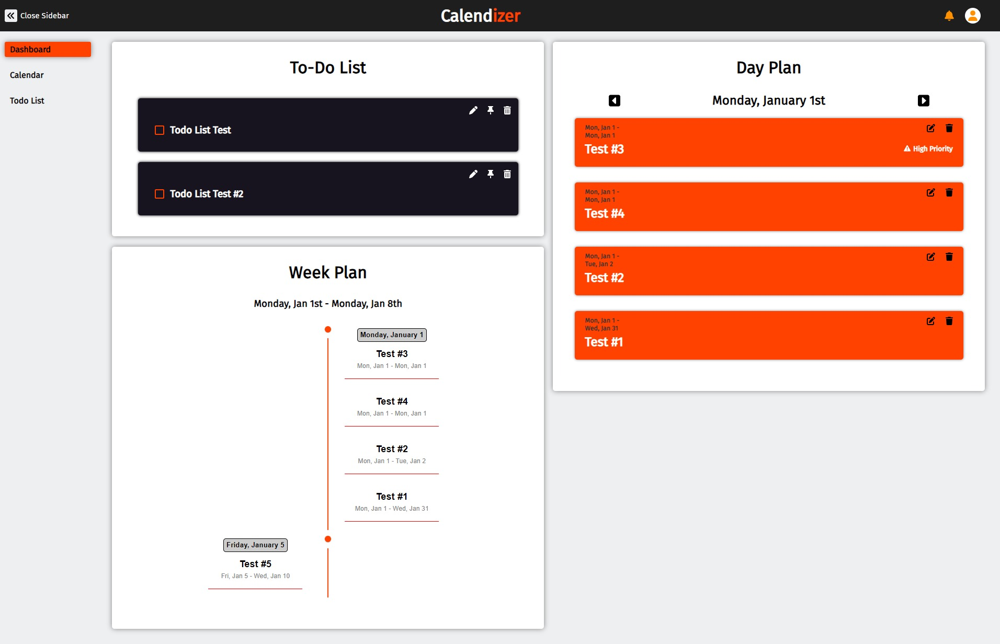

# Calendizer

Calendizer is a user-friendly online planner and organizer designed to help individuals efficiently manage their schedules, tasks, and events.



## Table of Contents

- [Getting Started](#getting-started)
  - [Prerequisites](#prerequisites)
  - [Installation](#installation)
- [Usage](#usage)
- [Technologies](#technologies)
- [Contributing](#contributing)
- [License](#license)

## Getting Started

### Prerequisites

Ensure that you have Node.js and npm installed on your machine.

### Installation

1. Clone the repository:

   ```bash
   git clone https://github.com/xCordeva/calendizer.git
   ```

2. Navigate to the project directory:

   ```bash
   cd calendizer
   ```

3. Install dependencies:

   ```bash
   npm install
   ```

4. Start the development server:

   ```bash
   npm run dev
   ```

## Usage

Access Calendizer at http://localhost:3000 once the development server is running.

## Technologies

Calendizer is built using the following technologies:

- Next.js
- React
- React Big Calendar
- SASS
- Firestore
- Firebase Authentication
- Redux Toolkit
- MUI (Material-UI) Libraries

## Contributing

Contributions are welcome! If you encounter a bug or have a feature request, please open an issue. If you'd like to contribute code, fork the repository and submit a pull request.

## License

This project is licensed under the MIT License.
